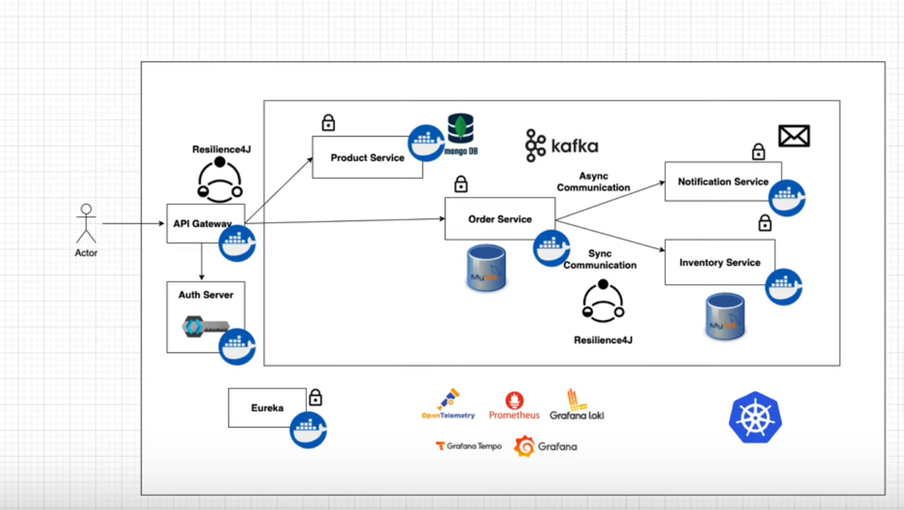
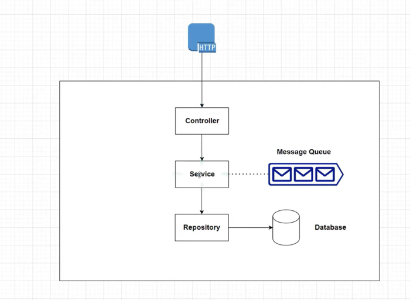

# shopping-app-microservices-backend
In this project I am building a simple online shopping application backend. The following concepts are covered:
+ Service discovery
+ Centralized configuration
+ Distributed tracing
+ Event Driven Architecture
+ Centralized logging
+ Circuit Breaker
+ Securing Microservices using Keycloack

The services contained in this project are
+ `Product Service:` - create and view products, act as product catalog
+ `Order Service:` -Can order products
+ `Inventory Service: `- Can check if product is in stock or not
+ `Notification service: `- can send notifications, after order is placed

These services are to communicate both `synchronous` and `asynchronous`

## Solution Architecture

## Tools and Technologies
+ Spring Boot
+ Resilience4j
+ MongoDB
+ Kafka
+ Docker
+ Prometheus
+ Grafana
+ Grafana Loki
+ OpenTelemetry
+ Kubernetes
+ MySQL

## Each Service Architecture

